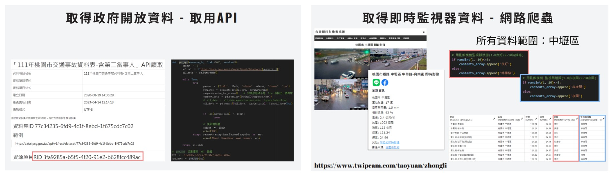

## 1121 服務導向架構與計算 期末專案

### 監控智能管理系統（Surveillance Intelligence Management System）

### 主題：在交通事故與犯罪多的區域，應該如何控管監視器？

#### 一、使用工具
1. python：資料提取(取用API、網路爬蟲)、資料清洗、selenium自動化
2. Docker：OpenMetadata、Airflow、Metabase 安裝部署
3. OpenMetadata：資料發現、資料沿襲、資料品質、可觀察性、治理和團隊協作
4. Airflow：創建、排程、監控多個不同工作流
5. Metabase：數據分析儀表板
6. PowerBI：地圖視覺化呈現
7. PostgreSQL：儲存數據
 

#### 二、主題
問題：在交通事故與犯罪多的區域，萬一監視器壞掉或是此地根本沒有監視器怎麼辦？
思考：有沒有一個可以回報監視器狀態以及交通事故、犯罪率多的區域與監視器位置行成一個地圖疊圖，可以有效地看出哪裡沒有監視器但卻需要監視器，又或是哪個區域為危險地區，監視器故障需要優先派人維修？

 

#### 三、使用資料集

1. 交通事故數據 https://data.tycg.gov.tw/opendata/datalist/datasetMeta?oid=77c34235-6fd9-4c1f-8ebd-1f675cdc7c02

2. 婦幼安全警示地點 https://data.gov.tw/dataset/6247

3. 汽車竊盜地點 https://data.gov.tw/dataset/26280

4. 監視器數據 https://www.twipcam.com/taoyuan/zhongli

 

#### 四、實作流程

Airflow 自動化流程(全自動化、排程工作流)

 

1. 抓取資料(API、爬蟲) -> 資料清洗 -> 存成csv
2. 存入資料庫
3. 自動下載metabase的dashboard
4. EMAIL傳送檔案

 

#### 五、結論
要懂得如何管理數據，讓數據轉化成可視化資訊解決隱藏的問題，並以自動化的工作流程，提升整體效率。

#### 六、實做影片連結

1. 實際操作OpenMatadata
https://youtu.be/Ijz2CDXaJdM
2. Airflow流程(資料清洗 存成csv 存入Postgresql)
https://youtu.be/Wo2eAcuQd1A
3. 實現完整Airflow流程
https://youtu.be/dr-vNz152rg
4. 使用selenium 自動下載 metabase的dashboard
https://youtu.be/pySFKHL_WeY

 